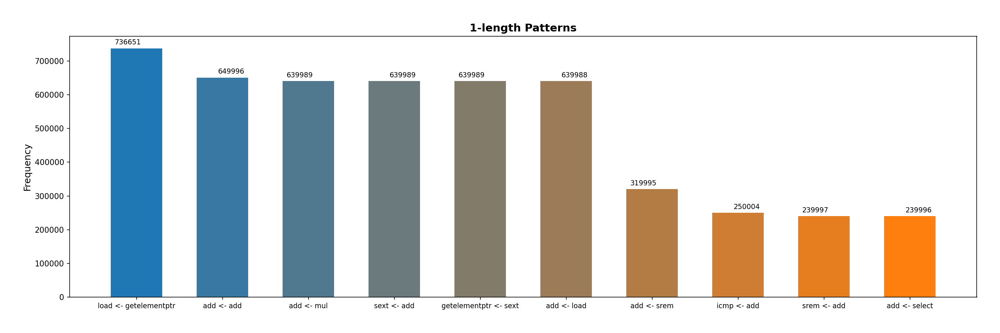
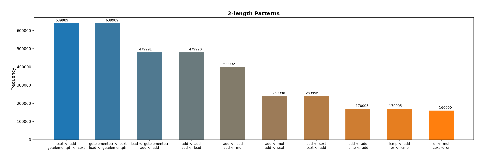
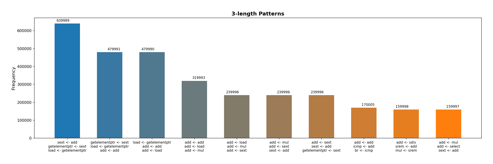
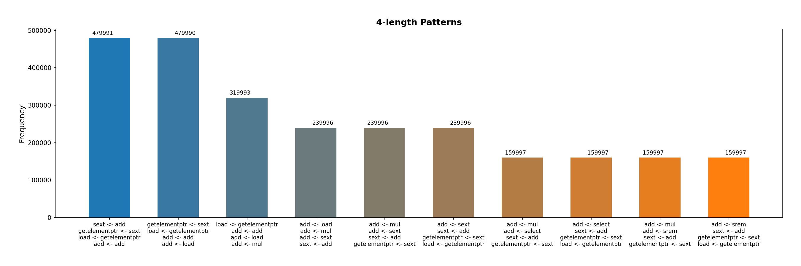
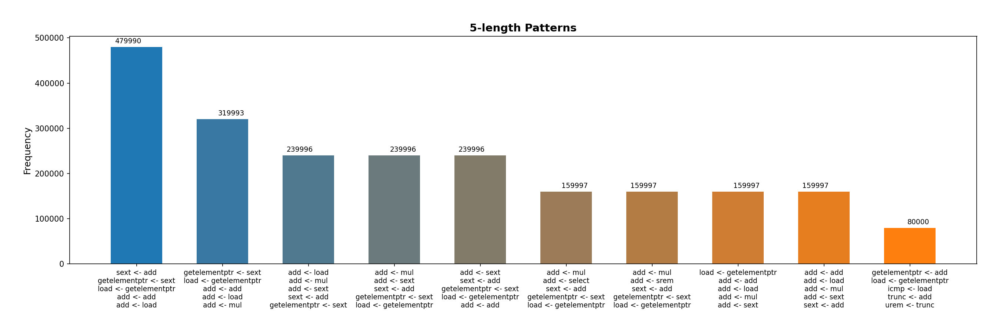

# LLVM Pass
Collect trace of executed instructions(and/or uses of executed instructions) of graphic app(without processing phi)

## Usage:
For building and using this pass you can copy this commands in your command line or use a script.
```
sudo apt install llvm
# Build LLVM Pass
clang++ Pass_trace.cpp -fPIC -shared -I$(llvm-config --includedir) -o artifacts/libPass.so
# Build LLVM IR for app.c without MyPass
clang ../SDL/app.c -emit-llvm -S -o artifacts/app.ll
# Build LLVM IR for app.c with MyPass
clang -fpass-plugin=./artifacts/libPass.so ../SDL/app.c -emit-llvm -S -o artifacts/app.log.ll
# Similar commands which return executable file with traces
clang -fpass-plugin=./artifacts/libPass.so log.c ../SDL/sim.c ../SDL/app.c ../SDL/start.c -lSDL2
clang log.c artifacts/app.log.ll ../SDL/sim.c ../SDL/start.c -lSDL2
```

The first argument must be ```path_to_app.c```, because we run this pass only for our application.
```
./trace.sh ../SDL/app.c ../SDL/start.c ../SDL/sim.c -lSDL2
```


## Pattern Analysis
For analysis save output of program in ```trace.log```. Then run Python script, barcharts of results will be in ```images/```
```
python3 gen_barcharts.py
```
Or you can use ```log_stat.sh```. It will return the list of patterns and their frequency.
```
./log_stat.sh path_to_log_file
```

Here you can see some results of analysis.




